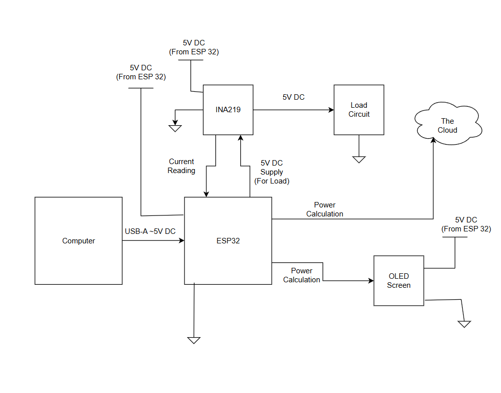

# Cloud Connected Power Meter

This project mostly follows [this article from Adafruit learn] with some modifications: ours is using an ESP32.

[this article from Adafruit learn]: https://learn.adafruit.com/build-a-cloud-connected-esp8266-power-meter

## Design Details

### High-Level Requirements
| Module | Cloud-connected power meter |
| --- | ---|
| Inputs | <ul><li>Power for mcu 5V and < 240mA</li><li>Voltage across a load < 26V</li><li>Current through a load $\pm$ 3.2A</li></ul>|
| Outputs | <ul><li>Power reading to the cloud</li><li>Power reading to OLED screen</li></ul> |
| Functionality| Monitors the power dissipated by an arbitrary load and displays it locally and on the cloud |

### Block Diagram

## Team Members

- Brenden Welch
- Casey Rasor
- Cullen Sharp 
- Derek Hernandez
- Shaiz Shaikh

## References

[Build a cloud connected esp8266 power meter](https://learn.adafruit.com/build-a-cloud-connected-esp8266-power-meter)

[INA219 High Side DC Current Sensor](https://www.adafruit.com/product/904)